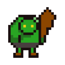

<p align="center">
  <b>Trollworks Engine</b>
  <br/>
  
  <br/>
  <b>Small 2D game engine based on SDL2 and Lua</b>
</p>

## :sparkles: Features

 - 2D scene editor
 - Asset management
 - Lua scripting
 - Entity Component System

## :hammer: Build


**Platforms:**

 - MingW 64bits (gcc, clang)
 - Linux **(TODO)**
 - Mac **(TODO)**

**Requirements:**

 - CMake >=3.22.0
 - GNU make

```
$ make build.debug
```

## 📝 License

This project is released under the terms of the [MIT License](./LICENSE.txt).
